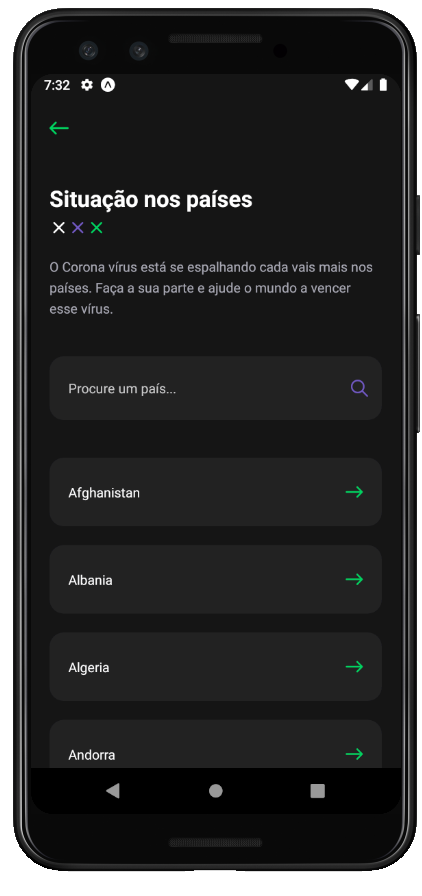

<h1 align="center">
    coronadev
</h1>

# Índice

- [Sobre](#sobre)
- [Tecnologias Utilizadas](#tecnologias-utilizadas)
- [Como Usar](#como-usar)
- [Como Contribuir](#como-contribuir)

## :bookmark: Sobre 

Ideia apresentada pela faculdade e adaptada por mim. Essa aplicação mostra a situação do Covid-19 em tempo real em todos países.

## :heavy_check_mark: Resultado

<h4 align="center">
    
</h4>

## :rocket: Tecnologias Utilizadas

O projeto foi desenvolvido utilizando as seguintes tecnologias

- [React Native](https://reactnative.dev/)
- [React Navigation v5](https://reactnavigation.org/)
- [Expo](https://expo.io/)
- [Styled Components](https://styled-components.com/)

## :iphone: Screens

<h4 align="center">
    
    
    
    
</h4>

## :fire: Como usar

- Clone esse repositório: `git clone https://github.com/vitorserrano/coronadev.git`
- Instale as dependências: `npm install` 
- Start a aplicação: `npm start`

## :recycle: Como contribuir

- Faça um Fork desse repositório,
- Crie uma branch com a sua feature: `git checkout -b my-feature`
- Commit suas mudanças: `git commit -m 'feat: My new feature'`
- Push a sua branch: `git push origin my-feature`

## :memo: License

Esse projeto está sob a licença MIT. Veja o arquivo [LICENSE](LICENSE) para mais detalhes.

<h4 align="center">
    Feito com 💜 by <a href="https://www.linkedin.com/in/vitor-serrano/" target="_blank">Vitor Serrano</a>
</h4>

